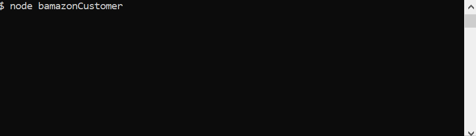
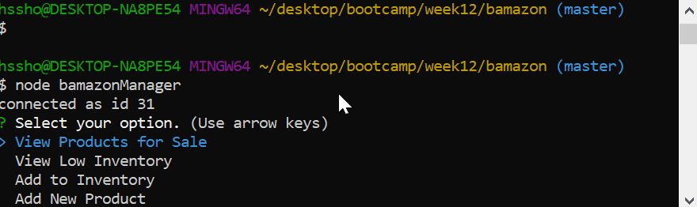
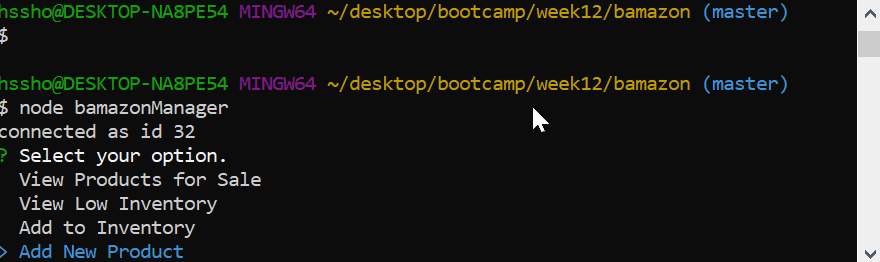

# bamazon
A command line retail application. There are two servers for this application. The Customer server will handle requests from the customer. It will display the store and allow the customer to select an item. It will check the inventory and display the total price. The Manager server will allow the manager to check the store's inventory and create new product and add inventory of existing product.

## Instructions
1. Run npm install 
### To run the customer app
2. On the command line, enter the command "node bamazonCustomer"
3. You will be presented with all of the items availabl for purchase. Select an item that you would like to purchase, using the arrow keys to move up and down the list.
4. You will be asked about the quanity you would like to purchase.
5. When a quantity is entered the command line will display the total cost. Or if there is not enough inventory to complete the purchase, the user will be notified how many items are in stock.

  
  
  

### To run the manager app
2. On the command line, enter the command "node bamazonManager"  
3. You will be presented with four options:

   i. View Products for Sale. This option will display a list of items for sale and their department, price, and quantity in stock.  

   ii. View Low Inventory. This option displays the items that have less than 5 items in stock.  

   iii. Add to Inventory. This option will display all of the items in the database. The user will select the item that they wish to add inventory. The user will be prompted to enter how many they would like to add. The item's quanitity will be increased by that amount in the database.  

  

   iv. Add New Product. This option will allow the user to add a new product to the database. It will prompt the user to input the name, department,  price, quantity. The new item will be added to the database.  

  
    
## Technology
* This app was a fun exercise in creating and exporting a javascript object. There is a Inventory object that is used by both the customer and the manager app.
* This app uses the inquirer node package for user prompts.
* This app uses the mysql node package for database interactions.

